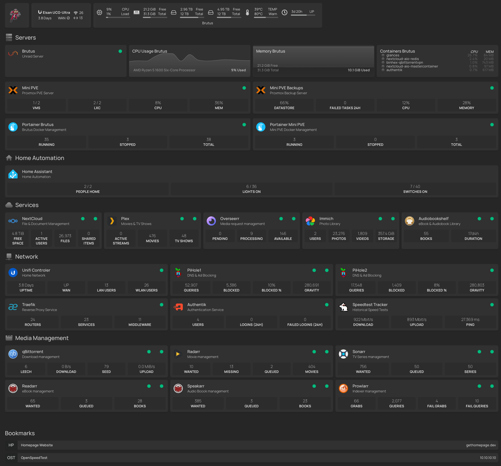
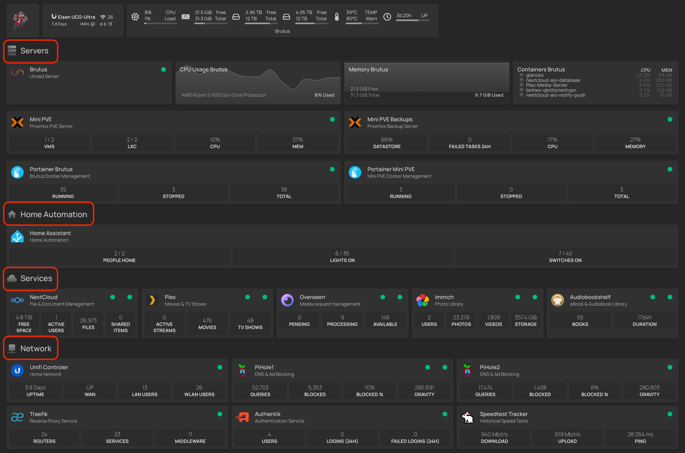

# Homepage 

## What is Homepage? 
Homepage is a beautiful and feature-rich dashboard for your homelab.  I use it to consolidate server and self-hosted services statuses, links to services and viarious API statistics from these servers and services all in one nice looking and fuctional dashboard. 

I use Homepage as my one-stop-shop for monitoring and accessing all my self-hosted homelab services.  It provides nice, glanceable info in a single pane of glass.  I can see server CPU or RAm utilization, if my services are up or down, key API info and more. With a single click it takes me right into whichever service I choose.  

It did not, however, get this way by itself.  It took a lot of configuration.  Many hours of trial and error.  And a few times completely abandoning the project - only to pick it back up later.  But after months of adding, tweaking and and getting things just right... I feel like I'm finally at a good place with my Homepage configuration.  For now, anyway. 😬

Here's a breakdown of how Homepage is configured and a look at my current Homepage setup... 




--------
## Layout & Theme

The layout of Homepage is very customizable, as is the theming. As we will cover later in this article, you can configure Homepage via various YAML configuration files.  The main two files used to confiigure Homepage is via the `settings.yaml` file and the `services.yaml` file.  Within these files, you can configure widgets into sections and each section into rows and columns. It is very customizable! 

* `services.yaml` - This is the main file you will configure all your service widgets in.  We will do a deeper dive into howto configure service widgets in another article. 

* `settings.yaml` - This is the main file used to configure the overall layout and theme of your Homepage dashboard, including:  
    * Set the background image, including effects like blur, saturation, brightness and opacity
    * Set dark or light themes
    * Set the color scheme
    * Set the header style
    * Set the status style


--------
### Widgets

*What is a widget, anyway?*

Widgets are little tiles that can  do a multitude of things.  They can show an app icon and name to easily identify what app the widget represents. They can show the status or ping of the site as well as the status of the Docker container, if hosted via Docker - these are the green dots you see. They can show various API statistics such as how many movies you have in your Plex library or how much storage your NextCloud is using on your NAS.  

!!! info
    Widgets are the bread'n'butter of your Homepage layout. When we refer to our layouts, we are mainly referring to how we are organizing the service widgets on our dashboard.  


--------
### Sections

In my layout, I have chosen to go with a few sections to keep things organized: 



* **Header Widgets** - An icon, router API info, server hardware status
* **Servers** - Widgets pertaining to my various servers and the admin of each
* **Home Automation** - Services relkated to home automation
* **Services** - Some of the key services I self-host
* **Network** - Services related to my network, reverse proxies and authentication
* **Media Management** - Services related to my home media server
* **Bookmarks** - Miscellaneous links with no APIs, etc.  Can be to any webpage, even ones you are not self-hosting. 

!!! note
    In my setup, I have also added some simple icons next to each section name to make them even easier to distinguish. 

    Of course, you can organize your layout any way <u>you</u> like!

The sections are defined in the `settings.yaml` file in the `layout:` section. 

```yaml title="settings.yaml"
# For configuration options and examples, please see:
# https://gethomepage.dev/latest/configs/settings

title: Eisan Servers
headerStyle: boxedWidgets # underlined, clean, boxed, boxedWidgets
language: en
target: _blank # Possible options include _blank, _self, and _top
theme: dark # comment out to allow picking on the web page
color: neutral # slate / comment out to allow picking on the web page
useEqualHeights: true
showStats: true
statusStyle: "dot" # dot, basic, or comment out for ping

background: 
  image: /images/bg1.jpg
  # blur: sm # sm, md, xl... see https://tailwindcss.com/docs/backdrop-blur
  # saturate: 80 # 0, 50, 100... see https://tailwindcss.com/docs/backdrop-saturate
  # brightness: 75 # 0, 50, 75... see https://tailwindcss.com/docs/backdrop-brightness
  # opacity: 100 # 0-100

cardBlur: sm # sm, "", md, etc... see https://tailwindcss.com/docs/backdrop-blur  !!!!! cannot use background blur, saturate, brightness or opacity above !!!!!


hideErrors: true

layout:
  Servers:
    icon: mdi-server
    style: column
    rows: 3
    Group A:
      style: row
      columns: 4
      header: false
    Group B:
      style: row
      columns: 2
      header: false
    Group C:
      style: row
      columns: 2
      header: false
  Metrics:
    style: row
    columns: 4
  Home Automation:
    icon: mdi-home
    style: row
    columns: 1
  Services:
    icon: mdi-cloud
    style: row 
    columns: 5
  Network:
    icon: mdi-network
    style: row 
    columns: 3
  Media Management:
    icon: mdi-movie
    style: row 
    columns: 3
```


--------
### Columns & Rows

After I determined what sections I wanted, I then configured the columns and rows.  I tried to do this in a way that would organize the widgets in a nice pattern with a few gaps or odd alignment issues as possible. 

Columns and rows are typically defined per each section.  However, a keen eye may have noticed that in my server section the first row of widgets is organized in four columns while the other rows are in two columns.  This is done by setting up nested groups within the section (see Group A, Group B & Group C in the code below). 

```yaml
layout:
  Servers:
    icon: mdi-server
    style: column
    rows: 3
    Group A:
      style: row
      columns: 4
      header: false
    Group B:
      style: row
      columns: 2
      header: false
    Group C:
      style: row
      columns: 2
      header: false
```


--------
## More to come!

Stay tuned for a deeper dive into how to configure Homepage into a beautiful and super useful self-hosted dashboard! In future articles, we will take a look at how to configure various service widgets, how to utilize an environment variable file to keep your secrets more suecure and more!